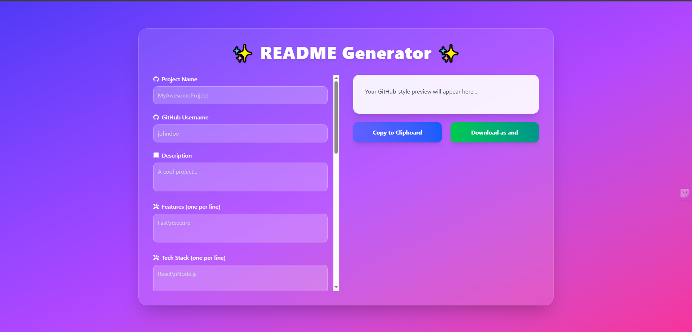

# Github README Generator
<!-- image of the project  -->

This project is a simple tool that helps users generate a well-structured README file for their Github repositories. 

## Table of Contents
## Features
- Input fields for Title, Description, Installation, Usage, License, Contributing, Tests, and Questions.
- Ability to preview the README before generating the file.
- Copy the generated README to clipboard.
- Download the generated README file.
- Ai suggestions are also available 

## Getting Started
To use the Github README Generator, simply enter your information in the input fields provided. Once you are satisfied with the preview, either copy the README to clipboard or download the file to use in your Github repository.

## Usage
1. Visit the Github README Generator website.
2. Fill in the input fields with the required information.
3. Preview the README file.
4. Copy the README to clipboard or download the file.
5. Paste or upload the README to your Github repository.

## License
This project is licensed under the MIT License - see the [LICENSE.md](LICENSE.md) file for details.

## Contributing
If you would like to contribute to this project, please fork the repository and submit a pull request.

## Support
If you encounter any issues or have any questions, please feel free to contact us at [subhrasundarsinha21@gmail.com](mailto:subhrasundarsinha21@gmail.com).

Thank you for using the Github README Generator!

## 🛠️ Tech Stack
- React
- Tailwind
- Framer Motion

## 📦 Installation

### Prerequisites
- Node.js (>= 14.x)

### Steps
1. Clone the repository:
   ```bash
   git clone https://github.com/PavilionRYZ/Github README Generator.git
   ```
2. Install dependencies:
   ```bash
   npm install
   ```


## 🚀 Usage
Explain how to use your project here.

## 🤝 Contributing
Contributions are welcome! Please follow the guidelines below.

## 📜 License
This project is licensed under the MIT License - see the [LICENSE](LICENSE) file for details.


---
*Generated with ❤️ by README Generator*